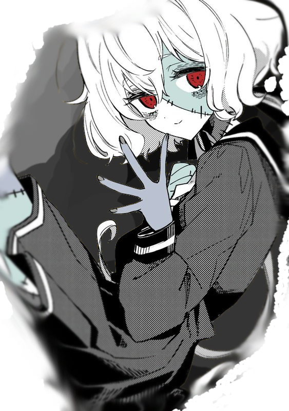
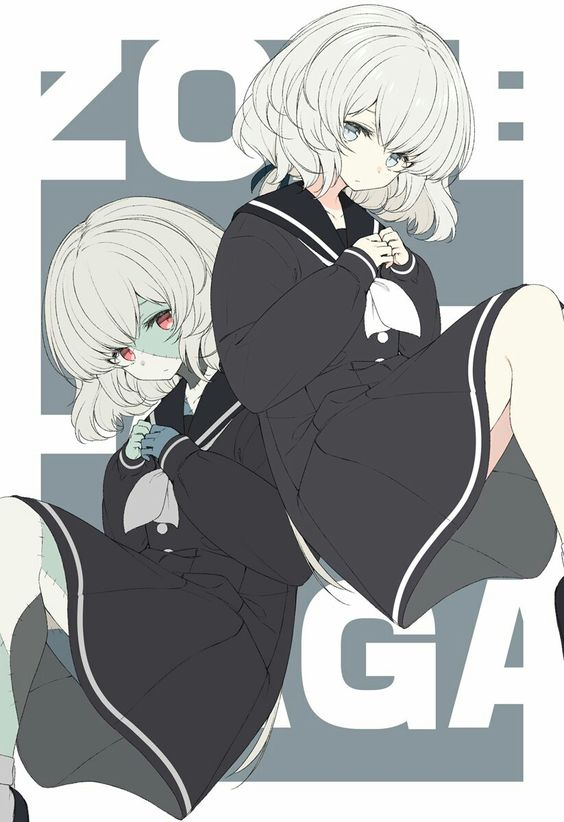
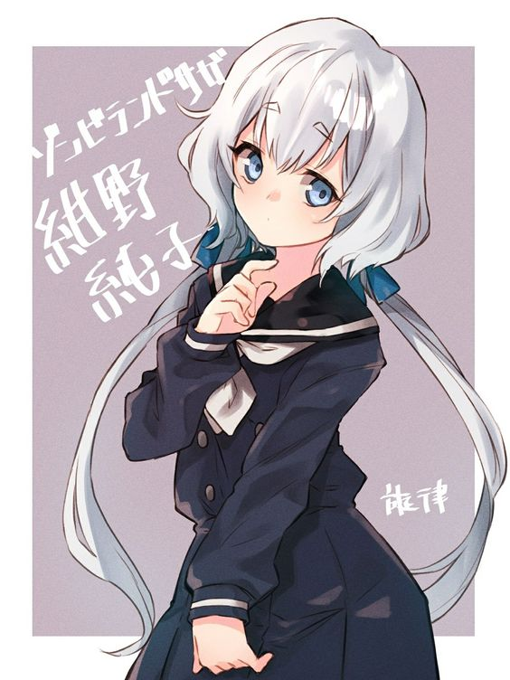
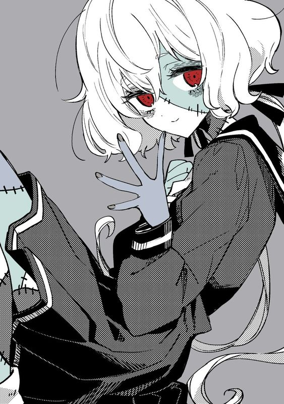
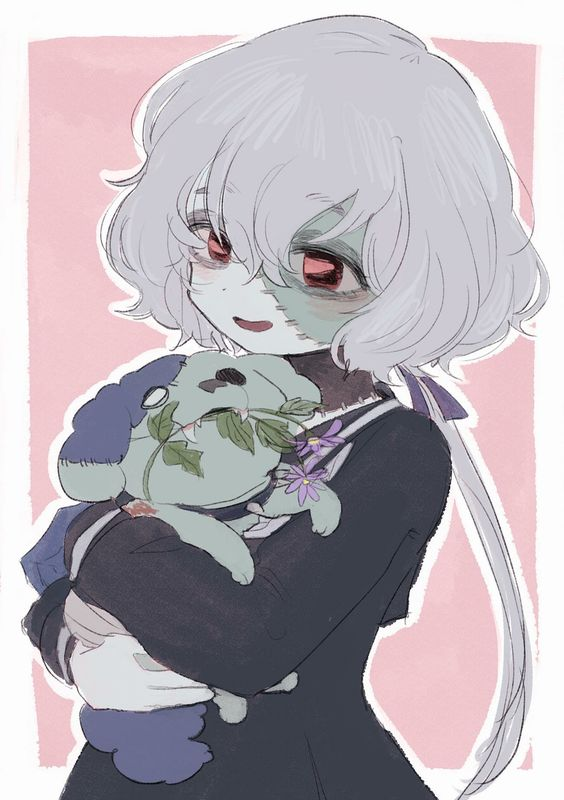
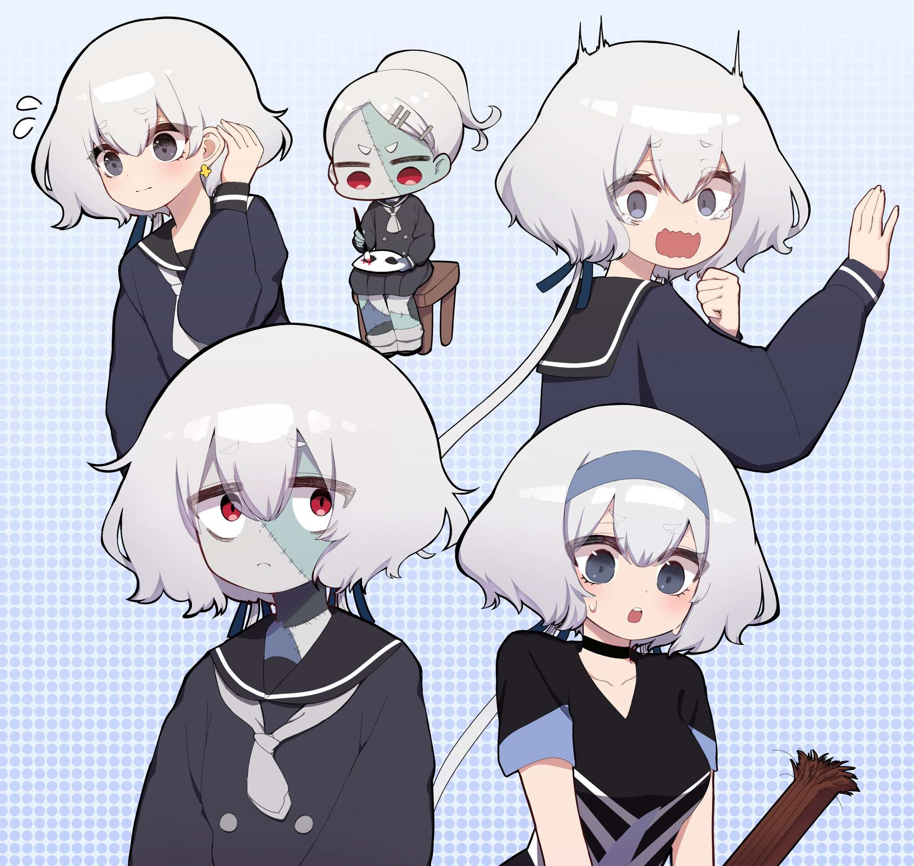

    

        <h2>Esme Yuki</h2>
        

        

        

            
        

        

            

                <strong>꧁ Imię: ꧂</strong> 
                <em>Esme</em> 
                <strong>꧁  Nazwisko:  ꧂</strong> 
                <em>Yuki</em> 
                <strong>꧁      Płeć:      ꧂</strong> 
                <em>Dziewczyna</em> 
                <strong>꧁ Wiek i data urodzin: ꧂</strong> 
                <em>fizycznie 17 lat - 30 lipca</em> 
                <em>normalnie 18 lat</em> 
                <strong>꧁              Rasa:              ꧂</strong> 
                <em>? Człowiek ?</em> 
            

        
     
    

    

    
    
    

        <a href="#character">
            
Charakter

        </a>
        <a href="#history">
            
Historia

        </a>
        <a href="#artifact">
            
Artefakt

        </a>
        <a href="#appearance">
            
Wygląd

        </a>
        <a href="#relations">
            
Relacje

        </a>
    

    

    

        
• ────── ✾ ────── •

        <h3> Osobowość </h3>
        
• ────── ✾ ────── •

        
  Esme jest niezwykle lojalna wobec osób które uznaje za swoich towarzyszy bądź nawet przyjaciół. Można nawet powiedzieć że priorytetuje ich dobro ponad swoje życie (które nie uważa za specjalnie wartościowe).
             Jest prawdziwą idealistką. Ciężko jej zranić kogokolwiek bo poszukuje w każdym choć odrobinę dobra co sprawia że dziewczyna zazwyczaj jest uśmiechnięta. Można ją też postrzegać jako osobę zdystansowaną lub nawet nieśmiałą. Przy czym jest bardzo samokrytyczna.
             Kiedy ją się lepiej poznać można wyszukać w niej pasję i wewnętrzny ogień który sprawia, że może naprawdę zabłysnąć. Często doznaje rozczarowań z powodu zbyt dużych oczekiwań i ambicji.
             Często bywa niezrozumiana lecz przy głębszych kontaktach uczy się lepiej porozumiewać z ludźmi.
             Dziewczyna posiada mocny system wartości który mimo wszystko sprawia że jest bardzo niezdecydowana. Z przeświadczenia Esme kieruje się bardziej własnymi zasadami a nie logiką czy bądź nawet praktycznością, z czego jest zresztą dumna, choć nie wszyscy rozumieją jej motywy działania.
             Mimo twierdzenia o umyśle ścisłym niektórzy mogą odkryć w niej umiejętności językowe. Przejawia się to w łatwości posługiwania się i przyswajania języków obcych. Uchodzi za osobę kreatywną i wyrozumiałą. A inność wszystkiego naokoło ją nie zraża.
             Esme zawsze skupia się na niewielkim gronie znajomych a przy kontakcie z większą ilością osób zaczyna czuć się komfortowo i z wolna wycofywać. 
             często traci ostrożność i się zamyśla żyjąc w swoim własnym wyimaginowanym świecie. 
        

    

    

    

        
• ────── ✾ ────── •

        <h3> Historia</h3>
        
• ────── ✾ ────── •

        
Dziewczyna wiodła normalne życie no co tu mówić. no prawie normalnie. dziewczyna od początku miała problemy z komunikacją między ludźmi.  pewnego dnia na urodziny dostała paczkę z naszyjnikiem. Nie wiedziała od kogo jest paczka ale korzysta z naszyjniku. Nie ma tu tak naprawdę co opowiadać bo nic ciekawego jej się nie wydarzyło w życiu. W sumie co miało skoro siedziała w domu przed książkami? mniejsza z tym.Nic ciekawego się nie zdarzyło do momentu kiedy z jakiegoś powodu poszła do parku. natchnęła ja po prostu taka ochota. wtedy z czystego nieba strzelił prosto w nią piorun. ku jej zdziwieniu obudziła się później leżąc w trumnie. ja szczęście jej jeszcze nie zakopali więc wydostała się. na jej szczęście zobaczyła siebie w lustrze i od razu uciekła. 
        

    

    

    

        
• ────── ✾ ────── •

        <h3> Moc </h3>
        
• ────── ✾ ────── •

        

        
 -/-

    

    

    gigma nigma
    

        
• ────── ✾ ────── •

        <h3> Choroba </h3>
        
-/-

        
• ────── ✾ ────── •

        <h4> Choroba psychiczna</h4>
        
-/-

        <h4> Fobia</h4>
        
Strach przed burzą
            ... w końcu tak umarła....
        

    

    

       

        
• ────── ✾ ────── •

        <h3> Umiejętności </h3>
        
• ────── ✾ ────── •

        
 kopiowanie. sama nie potrafi rysować ale z "refką" łądnie jej wychodzi

        
 spanko w każdej pozycji

        
 makijaż

        

    

    

    

        
• ────── ✾ ────── •

        <h3> Wyposażenie </h3>
        
• ────── ✾ ────── •

        
Naszyjnik zmarłych - Dziewczyna jest w stanie umrzeć ale nie robi jej to większej różnicy. dopóki naszyjnik jest na szyi to nawet po śmierci jej dusza powróci do ciała na którym naszyjnik się znajduje( w tym martwe ciała). dusza pierwszego właściciela jest przypisana do naszyjnika dopóki ten nie zostanie zniszczony lub właściciel nie zrzeknie się naszyjniku.
        

    

    

        
• ────── ✾ ────── •

        <h3> Inne </h3>
        
• ────── ✾ ────── •

        <h4>Pseudonim</h4>
        
-/-

        

        <h4>Orientacja </h4>
        
Bi

        

        <h4>Klan</h4>
        
-/-

        

        <h4>Zwierzak</h4>
        
-/-

        

        <h4>Co lubi?</h4>
        
-Kotecki
             -Książki
             -Rysować choć jej to nie wychodzi
        

        

        <h4>Za czym nie przepada?</h4>
        
-Głośnymi miejscami
             -Ogólnie głośne zwierzęta i ludzie
             -Rosół
        

        

        <h4>Zainteresowanie:</h4>
        
Rysowanko, czytanie, spanko

        

        <h4>Ciekawostki</h4>
        

            -boi się żę zaczną jej rosnąć we włosach grzyby 
             -"nie-zombie" wygląd zawdzięcza makijażowi
             -boi i wstydzi się faktu bycia "zombie"
        

    

    

    

        
• ────── ✾ ────── •

        <h3> Wygląd </h3>
        
• ────── ✾ ────── •

        
<strong>Wzrost:</strong> 155cm

        

        <a href="https://www.youtube.com/watch?v=ug3Ss9QGAtY"><h4>Głos postaci</h4></a>
        

        <h4>Znaki Szczególne:</h4>
        
Zszyte, zwęglone, poranione ciało

        
          
    

    

        

        
    

    

    

        
    

    

    

        
    

    

    

        
    

    

    

        
    

    

    

        <h3>Relacje:</h3>
    

    

    

        

        <h3>Credits:</h3> 
        

        <a href="https://en.wikipedia.org/wiki/Zombie_Land_Saga" class="credits"> Zombie Land Saga
        </a>
    

    

    

        <a href="#up">
            
W górę

        </a>
    

    

    

